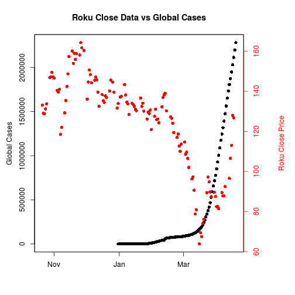

Slides
========================================================
author: 
date: 
autosize: true

First Slide
========================================================
We sought to explore the effects of the coronavirus on the entertainment industry. Specifically,
we compared companies that had streaming services vs. the companies who were primarily brick and mortar movie theaters.

Initially, we planned to look at Apple, AT&T, Amazon, Netflix, Disney, AMC, Cinemark, Google, and Roku. However, Disney, AT&T, Amazon, Apple, and Google all had extremely diversified business portfolios that made the effects of the coronavirus on the streaming industry vs brick and mortar theater industry harder to interpret. As such, it made more sense to narrow the comparisons down to AMC and Cinemark, two of the largest players in the movie theater industry, and Netflix and Roku, one of which is the largest streaming service and the other provides devices streamlined to access streaming services.

Slide With Code
========================================================

Slide With Plot
========================================================

